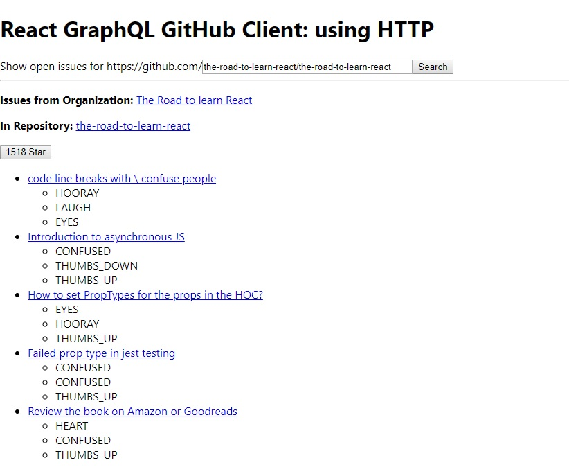

# React GraphQL application using HTTP:
- A React application that consumes the GitHub GraphQL API.
- The application should show open issues in a GitHub repository, making it a simple issue tracker.
- Key Features:
    - React (with Hooks)
    - GraphQL HTTP
    - Pagination
    - GitHub API

## After cloning:
```
yarn install
```

- Create .env file and add your REACT_APP_GITHUB_PERSONAL_ACCESS_TOKEN

```
yarn start
```

## Dealing with errors:
- After setting up environment variable in react please remember to restart server.

## Shortcomings of using puristic HTTP methods to read and write data to your GraphQL API in a React application:
- GraphQL doesn’t use the full potential of HTTP:
    - It’s just fine to default to HTTP POST and only one API endpoint.
    - Every time you make a query or mutation when using plain HTTP requests, you have to make a dedicated call to the API endpoint using a library such as axios.
- There is no one helping you out with normalizing your data and caching it for identical requests.
    - You have to deal with deeply nested state objects which lead to the verbose usage of the JavaScript spread operator.
- GraphQL subscription for receiving realtime data in a client-sided application.
    - if you would introduce a GraphQL library for it on the client-side, the library would probably implement GraphQL subscriptions for you.

## Landing Page:

